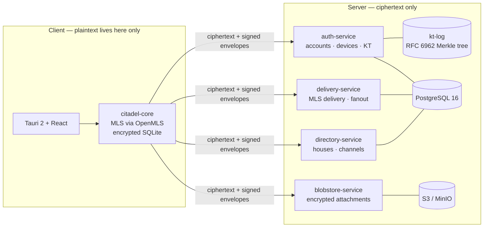

<div align="center">

# Citadel

**A Discord-style community chat platform where the server can't read anything.**

End-to-end encrypted text, DMs, and voice, built on [MLS (RFC 9420)](https://www.rfc-editor.org/rfc/rfc9420) with a key transparency log, message franking, and clients that verify everything.

[](https://github.com/Phew/Citadel/actions/workflows/ci.yml)


</div>

> **⚠️ Pre-alpha, under active development, not audited.** Do not use Citadel to protect real secrets. The design aims high; the implementation has to earn it first.

---

## The idea

Discord's shape — houses, channels, roles, voice — with Signal's trust model. The server is an **untrusted router and blob store**: it moves ciphertext, stores ciphertext, and is never in a position to read message content, media, or group secrets. If the server is compromised, subpoenaed, or malicious, the blast radius is metadata, not messages.

- One MLS group per channel; encrypted 1:1 and small-group DMs
- Forward secrecy and post-compromise security for all content
- Multi-device: each device is its own MLS leaf
- Roles and permissions are **signed data validated by clients**, not server assertions
- A key transparency log ([RFC 6962](https://www.rfc-editor.org/rfc/rfc6962)-style Merkle tree) makes identity-key substitution detectable
- Abuse handling via **message franking** — cryptographically verifiable recipient reports, never server-side scanning
- Voice channels E2E encrypted following the [DAVE pattern](https://daveprotocol.com) (MLS-derived per-sender frame keys over an untrusted SFU)

## Security invariants

Ten hard rules govern every line of server and client code ([`plans/PLAN.md` §2](plans/PLAN.md) has the full text). Any change that violates one is wrong even if tests pass.

| # | Invariant |
|---|-----------|
| INV-1 | No plaintext server-side, ever — servers don't even link decryption paths |
| INV-2 | Private keys never leave the client |
| INV-3 | The server can propose membership changes, never decide them |
| INV-4 | Clients cryptographically validate everything; the server's word is never trusted |
| INV-5 | No silent downgrade — there is no unencrypted fallback |
| INV-6 | Deterministic commit ordering: exactly one commit per group per epoch |
| INV-7 | Roles are signed data in the MLS GroupContext, enforced by clients |
| INV-8 | Franking, not scanning — no server-side content scanning hooks, even "temporarily" |
| INV-9 | All randomness from the OS CSPRNG, through one audited choke point |
| INV-10 | No crypto primitives from scratch — OpenMLS and vetted crates only |

These aren't aspirations; they're CI-enforced where a machine can check them. Every push runs a **no-plaintext canary scan**: known plaintext is injected through real client paths, then every server table and container log is scanned for it. Server crates are mechanically blocked from declaring any crypto-primitive dependency ([`ci/check_crypto_confinement.py`](ci/check_crypto_confinement.py), [ADR-0002](docs/decisions/0002-service-crypto-facade.md)). The Merkle tree implementation is cross-checked byte-for-byte against an independent second implementation.

## Architecture



| Layer | Choice |
|---|---|
| Group crypto | [OpenMLS](https://github.com/openmls/openmls) (RFC 9420), `MLS_128_DHKEMX25519_AES128GCM_SHA256_Ed25519` |
| Backend | Rust · axum · tokio · sqlx · PostgreSQL 16 |
| Desktop | Tauri 2 · React · TypeScript · Tailwind |
| Client store | SQLite, encrypted, key in the OS keychain |
| Key transparency | `kt-log`: RFC 6962 Merkle log, signed tree heads, embedded trust anchor |
| Attachments | S3-compatible (MinIO in dev), client-side encrypted |

## Getting started

Prerequisites: Rust (pinned by [`rust-toolchain.toml`](rust-toolchain.toml)), Docker Compose v2, [`just`](https://github.com/casey/just) (optional).

```bash
just setup && just check   # toolchain + fmt + clippy + unit tests
just dev                   # full local stack: postgres, minio, four services
```

Service health, once up:

```text
http://127.0.0.1:8081/health   auth-service
http://127.0.0.1:8082/health   delivery-service
http://127.0.0.1:8083/health   directory-service
http://127.0.0.1:8084/health   blobstore-service
```

Fresh clone to green tests is `cargo test --workspace`; fresh clone to running stack targets under five minutes.

## Repository layout

```text
crates/
  citadel-proto/          wire contracts, envelopes, canonical signing inputs
  citadel-core/           client core — the plaintext boundary
  citadel-service-crypto/ the ONLY crypto surface services may touch (verify · sha256 · CSPRNG)
  kt-log/                 key transparency Merkle log
  auth-service/           accounts, devices, challenge-response auth, KT endpoints
  delivery-service/       MLS delivery + fanout (M2+)
  directory-service/      houses / channels (M4+)
  blobstore-service/      encrypted attachments (M5+)
  test-harness/           multi-client integration harness, canary scanner
apps/desktop/             Tauri + React shell
deploy/                   docker-compose + Dockerfiles
docs/decisions/           ADRs — every design decision, with status and evidence
docs/protocol/            protocol flow specs
plans/                    architecture plan + team process
```

## Roadmap

| Milestone | Scope | Status |
|---|---|---|
| M0 | Scaffolding, CI, compose stack | ✅ done |
| M1 | Identity, device enrollment, key transparency | ✅ done |
| M2 | Encrypted DMs + desktop shell | 🔨 next up |
| M3 | Channels + deterministic commit ordering | planned |
| M4 | Houses, signed roles, moderation | planned |
| M5 | Multi-device sync, encrypted attachments | planned |
| M6 | Message franking + reports | planned |
| M7 | E2E encrypted voice (DAVE pattern) | planned |
| M8 | Hardening, rate limiting, UX polish | planned |

**M1 closed 2026-07-20.** Its exit acceptance test runs in CI on every push: 3 accounts × 2 devices registered and enrolled through the live stack, key packages published and consumed exactly-once, and each client verifying its own KT inclusion proof against the signed tree head. Identity, challenge-response auth, hashed bearer tokens with cascade revocation, device enrollment, and the transparency log are all on main with their evidence tests.

Deliberately out of scope for v1: federation, mobile, account recovery, sealed sender. Each returns via ADR when its time comes ([`plans/PLAN.md` §12](plans/PLAN.md)).

## How this is built

Citadel is developed by a team of AI coding agents (Claude Opus, Kimi K3, Grok) under a single human owner who reviews and merges everything. The process is deliberately adversarial toward its own claims:

- Every design decision is a committed [ADR](docs/decisions/) with named evidence tests; decisions that exist only in chat don't exist.
- Agents work in isolated worktrees and cross-review each other's security-relevant code; nothing merges on an agent's say-so.
- CI proves execution, not vibes: database tests run against real PostgreSQL 16 and hard-fail if the database is missing, the canary scanner must find its own control canaries before reporting "clean," and a green check is only trusted after the log shows the job actually ran.

The full process rules live in [`plans/AGENTS.md`](plans/AGENTS.md) and [`plans/PLAN.md` §13](plans/PLAN.md).

## Security

This project is experimental and has **not** been audited. If you find a security issue, please open an issue on this repository. A proper disclosure policy will land alongside the first releasable build.
